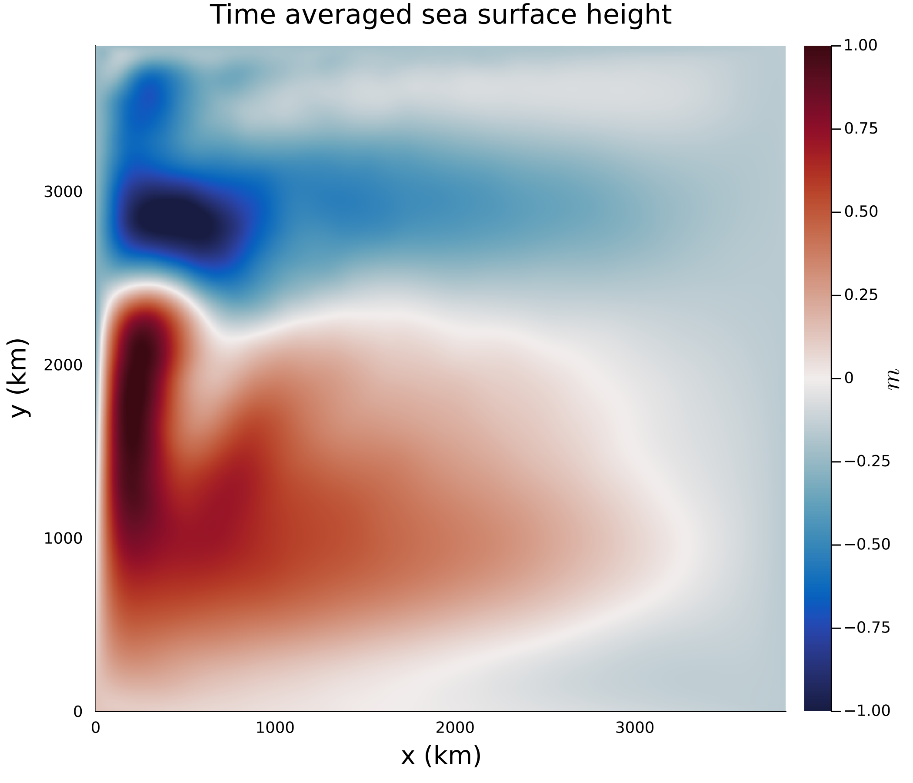

# Estimation and UQ of eddy momentum stresses

The goal of this project is to leverage a differentiable Oceananigans.jl to estimate eddy momentum stresses in an idealized domain. We are also interested in quantifying the uncertainties in these eddy momentum stresses.

**Eddy momentum stresses** (often referred to as Reynolds stresses) represent the effect of small-scale (mesoscale) eddies on the large-scale mean flow. Since ocean models are often too coarse to resolve small-scale eddy effects (like eddy momentum stresses), these effects need to be parameterized in ocean models. For more background information on mesoscale eddies, mesoscale eddy parameterizations, eddy momentum stresses, and techniques to estimate the latter, see the issue "Background material".

Our initial plan is roughly as follows (but can definitely adapted and changed anytime!):

1) We could use and compare the following techniques to **estimate the eddy momentum stresses**:

	a) "online estimation" with the full model adjoint (similar to Ferreira et al. (2005), except that they estimated a different kind of eddy stress: not the Reynolds stresses). Here, we have to decide if we want to (i) estimate the full eddy momentum stresses, or (ii) estimate a coefficient in front of a prescribed parameterized term (essentially a viscosity coefficient);
	
	b) "online estimation" via machine learning: plug a neural network or neural ODE into oceananigans.jl and "train" the full model, including the neural network parameters as a whole ("whole-model-learning");
	
	c) "offline estimation" via machine learning: train a convolutional neural network offline, then plug this into oceananigans.jl

Most previous studies have pursued the "offline" approach c). But since their machine learning model is written in a different language (often python) than the ocean model (pretty much always FORTRAN), "plugging" the trained convolutional neural network back into the model has been usually difficult for those previous studies. Another common problem is that approach c) does not lead to stable model solutions. Approaches a) and b) have pretty much not been pursued before because most models are not differentiable.

2) As a second step, we can do **uncertainty quantification (UQ)**. We could infer the posterior uncertainty 

	a) on the coefficients, consistent with approach 1)(a). This would involve the Hessian, see e.g., Loose & Heimbach (2021);

	b) on the neural network weights, consistent with approach 1)(b). We think that no-one has ever considered to compute the Hessian of the loss function with respect to the neural network (NN) weights, so this could be a compelling path to answer the question of “how do you quantify uncertainties in NN training?”.

This repo serves for opening and working on issues and milestones. The associated project helps us to stay organized, and keep track of issues and progress. 

**References mentioned above**: 

Bolton, Thomas, and Laure Zanna. “Applications of Deep Learning to Ocean Data Inference and Subgrid Parameterization.” Journal of Advances in Modeling Earth Systems 0, no. 0. Accessed February 3, 2019. https://doi.org/10.1029/2018MS001472.

Ferreira, David, John Marshall, and Patrick Heimbach. “Estimating Eddy Stresses by Fitting Dynamics to Observations Using a Residual-Mean Ocean Circulation Model and Its Adjoint.” Journal of Physical Oceanography 35, no. 10 (October 1, 2005): 1891–1910. https://doi.org/10.1175/JPO2785.1.

Guillaumin, Arthur P., and Laure Zanna. “Stochastic-Deep Learning Parameterization of Ocean Momentum Forcing.” Journal of Advances in Modeling Earth Systems 13, no. 9 (2021): e2021MS002534. https://doi.org/10.1029/2021MS002534.

  
  
